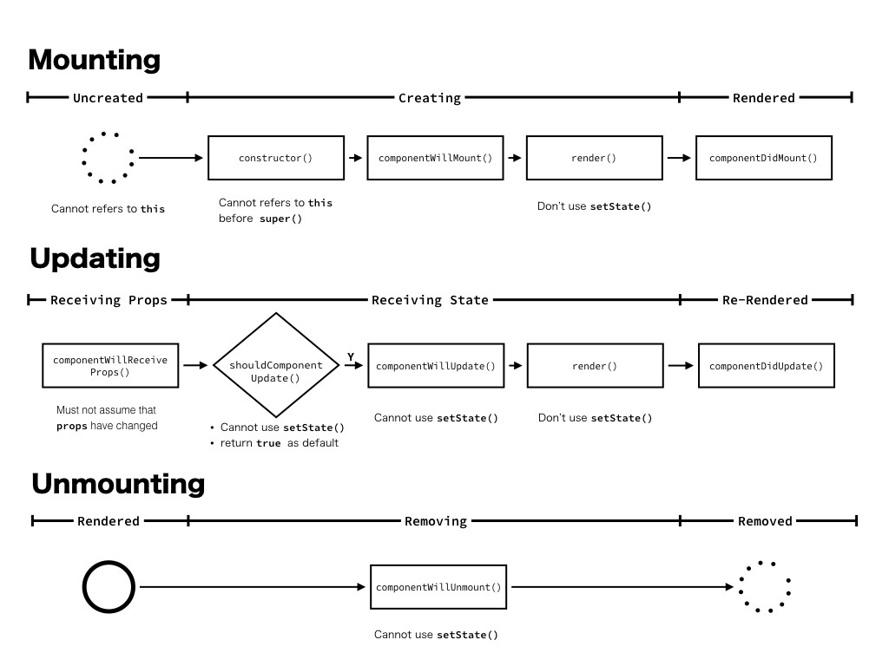
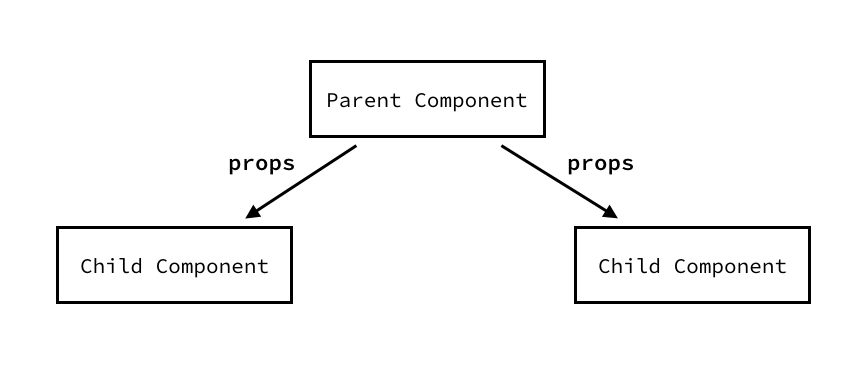

# REACT 의 Compnent에 관해서

#### UI를 하나의 수식으로 정의하면,

```
UI = View(State)
```

<p>React는  func View에 해당된다. <br/>State를 받아, UI( React Element )를 return 하는 func.<br/>
    => 이를 통해서, "UI를 재사용하고 독립적 단위로 쪼개어 생각을 할 수 있다."<br/><br/>
<b>UI</b>를 구성하기 위해선, 화면에 Comp를 그리고(Mounting), 갱신하고(Updating), 지워야(Unmountion)한다.</p>


<p>각 프로세스가 진행 될 때에, Lifecycle func이라고 불리는 특별한 함수가 실행된다.<br>이를 재정의하여 Comp를 제어하게 되므로, Lifecycle func에 대해 깊은 이해가 필요하다.</p>




> <i>figure 01</i> 각 프로세스에 대응하는 Lifecycle func을 표현한 다이어그램.


#### 작동 예시

* <b>Mounting:</b> Creating 중인 ``componentWillMount() `` 에서 Ajax 요청을 하면, 응답시간만큼 컴포넌트를 그리는 것이 늦어진다.<br/>따라서 일반적으로는, ``componentDidMount( )``에서 Ajax 요청을 하는게 좋다.
* <b>Updating:</b> Receiving State중, ``setState( )`` API를 호출하면,  재귀적으로 무한 루프에 빠질걸 알 수 있다.

#### React Component 의 Props와 State

<i><b>Props</b></i>는 컴포넌트의 mounting, updating 프로세스 시점에 값이 할당 될 뿐, 컴포넌트 내부에서 값 변경이 불가능하다.<br/>상황에 따라 변경되어야 하는 값들은 <b><i>state</i></b>를 사용해야 한다.

이러한 설정에 관한 이유는, <b>명확한 관념 모델( Static mental model )</b>을 제공하기 때문이다.

만약, input으로 들어오는 <b><i>props</i></b>를 컴포넌트 내부에서 변경 가능하다면, <i><b>props</b></i>를 내려주는 부모 컴포넌트에도 영향이 가야 할 것이다.

하지만, <i><b>Probs</b></i>와 <i><b>State</b></i>를 분리해 놨기 때문에, 개발자는 이러한 부분에 관해 고민을 할필요가 없다.  

컴포넌트 간에는 반드시 <i><b>Props</b></i>를 통해 데이터를 주고받고, <i><b>Props</b></i>는 컴포넌트 내부에서 변경되지 않는다.<br/>따라서 상속관계 양쪽에 대해서 고민할 필요가 없고, 아래 한 쪽 방향(<b>uni-directional</b>) 그리고 자기 자신에 대해서만 고민하면 된다.



> <i>figure 02</i>) 계층 기준으로 부모 자식 관계를 표현한 React 컴포넌트 관계도


#### setState() API in React Component

component는 ``` setState( )```<i>(이하 `setState`)</i>라는 API가 존재한다.<br/>component의 <i><b>state</b></i>를 변경할 때 사용하는 API이다.

js의 비교연산자는 피연산자의 값이 아닌 reference 값을 기준으로 ture/false값을 리턴하기 때문에, <i><b>state</b></i>를 변경할 때, API를 사용해야 하는 것.<br/>

>```js
>var a = { value: 'initial value' };
>var b = { value: 'initial value' };
>var c = { value: 'initial value' };
>var d = c; //pass by reference
>console.log(a === b, c === d);
>```

>`result: false true`

<br/><i><b>state</b></i>의 값을 직접 변경할 경우,  해당 Obj의 reference 값이 변하지 않아, Component는 <i><b>state</b></i>가 변경되지 않았다고 보기 때문이다.<br/>따라서, 화면이 갱신되지 않는 것이다.

그러므로,  <b>React</b>는 `setState`를 사용해, 기존 <i><b>state</b></i>와 merge하여, <b><i>state</i></b>의 변경 가능성을 알려준다.<br/>더 중요한 사실은, `setState`는 비동기로 동작한다는 점 이다.<br/>상태가 변경된 이후 필요한 작업이 있다면, `setState(nextState, callbackfunc)`의 `callback`을 사용해야 한다.

따라서, 이는 보장되지 않는다.

1. `setState` 호출 직후에 `state`는 즉시 갱신되지 않을 수 있다.
2. 한 컨텍스트 내에서, `setState`호출 수와 Comp의 업데이트 수는 같지 않을 수 있다.

그러나, `setState`를 사용하며, 다음의 기능은 보장된다.

1. `setState` 실행순서
2. `setState`의 `callbackfunc`의 실행순서
3. `state`의 변화가 event 실행 전에 Comp에 반영된다.

<br/>왜 `setState`는 비동기로 동작할까?<br/>이는 끊김 없는 원활한 UI/UX를 제공키 위해, 일정 빈도의 `render` 를 수행시키기 위해서다.<br/>`setState`가 동기로 동작한다고 가정해볼 떄, `state`변경이 잦아질수록, `render`는 모든 변경이 적용될 때 까지 늦어지기 때문에, 유저가 보는 화면은 부자연스러워 질 꺼기 때문이다.<br/>비동기 형식으로 동작하게 된다면, `render`하고는 별개로 동작하기 떄문에 자연스런 갱신이 가능해진다.


#### +alpha

##### 기본 컴포넌트 ( Basic Component )

```js
class Button extends React.Component {
    render() {
        const { className } = this.props;
        return <button type="button" className= {className}/>;
    }
}

<Button ClassName="myBtn"/>
```

개발자가 일일히 `<button type="button"/>`를 작성해야 하는 것을 일반화 시킨다.

##### 고차 컴포넌트 (Higher Order Component )

고차 컴포넌트의 대표적 예시는 react-redux의 `connect( )`나, Relay의 `createContainer( )`등이 대표적인 예시이다.<br/>고차 컴포넌트는 컴포넌트를 input으로 하고, 컴포넌트를 output으로 하는 함수라고 생각하면 된다.

```pesudo code
// @flow
hoc = (input: React.Component): React.Component => output
```

실제 구현은,

```js
import react, { Component } from "React";

export var Enhance = ComposedComponent => class extends Component{
    constructor() {
        this.state = {data: null};
    }
    componentDidMount() {
        this.state({ data: 'Hello'});
    }
    render() {
        return <ComposedComponent {...this.props} data = {this.state.data} />;
    }
};

import { Enhance } from "./Enhance";

class MyComponent {
    render() {
        if( !this.data ) return <div>Waiting..</div>;
        return <div>{this.data}</div>;
    }
}

export default Enhance(MyComponent); //Enhanced component
```

 

